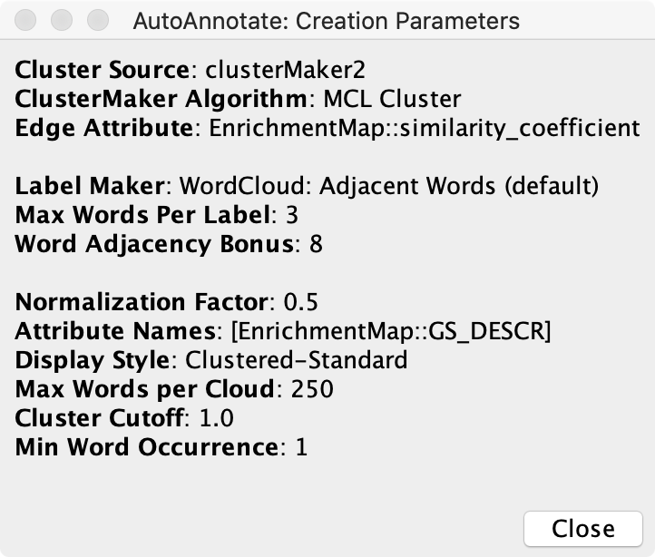
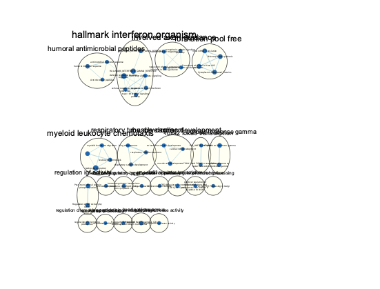
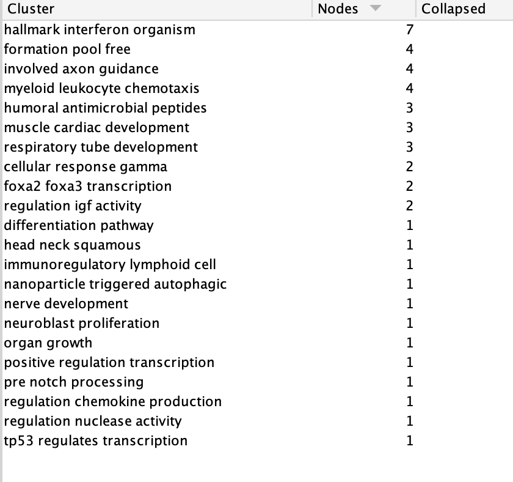
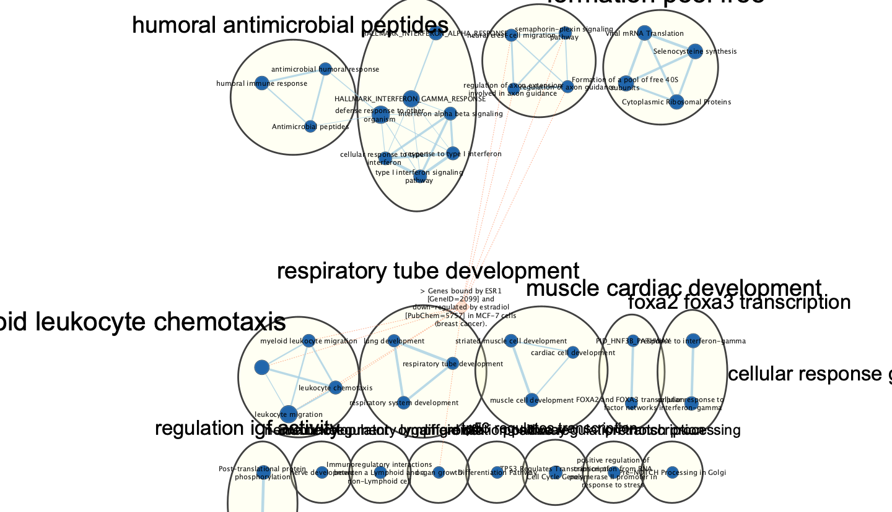

```{r setup, include=FALSE}
knitr::opts_chunk$set(echo = TRUE)
```

# Introduction

# Non-thresholded Gene set Enrichment Analysis

## 1.What method did you use? What genesets did you use? Make sure to specify versions and cite your methods.

I used GSEA [@gsea1, @gsea2] with the following parameters:

* Number of permutations: 1000

* Max size: 250

* Min size: 15

* Version: 4.1.0

Also, used the Human GO Biological Pathways geneset curated by Bader Lab on March 1, 2021, obtained [here](http://download.baderlab.org/EM_Genesets/March_01_2021/Human/symbol/) [@bader_genesets].


## 2.Summarize your enrichment results.
From enrichment result, it shows more downregulated gene set than upregulated, where upregulated have 2005 / 5459 gene sets and down regulated have 3454 / 5459 gene sets. As from the experiment,the enhancers are be mediated by inducing RNA enhancers. 

## 3.How do these results compare to the results from the thresholded analysis in Assignment #2. Compare qualitatively. Is this a straight forward comparison? Why or why not?

From both tools it shows the under regulation is more than upregulation. From the article, it says it can downregulated some, but not all, which is similar to the result from the tools. For aualitatively, GSEA was able to find more genesets, compare to G:Profiler, because GSEA uses non-thresholded instead of thresholded enrichment analysis. However the comparison is not straight-forward. Both tools are meant to provide an exploratory view of the data for further analysis, not to draw conclusions.

# Cytoscape Visualization

## 1. Create an enrichment map - how many nodes and how many edges in the resulting map? What thresholds were used to create this map? Make sure to record all thresholds. Include a screenshot of your network prior to manual layout.

46 nodes and 47 edges. The following thresholds were used:

* FDR q-value cutoff: 0.1

* p-value cutoff: 1.0

* Metric: Jaccard+Overlap cutoff at 0.5 for sparser graph


## 2. Annotate your network - what parameters did you use to annotate the network. If you are using the default parameters make sure to list them as well.





## 3.Make a publication ready figure - include this figure with proper legends in your notebook.



## 4.Collapse your network to a theme network. What are the major themes present in this analysis? Do they fit with the model? Are there any novel pathways or themes?

The theme for this analysis is interferon, it fits the model because the for all other clusters are pathways that can be effected by ER interferon. The target of the model is the interferon and the any other metabolism that can be effected by them. The other theme can be myeloid leukocyte chemotaxis, but this is not focus in the model. However, it still have 4 nodes in the cluster.

# Interpretation
## 1.Do the enrichment results support conclusions or mechanism discussed in the original paper? How do these results differ from the results you got from Assignment #2 thresholded methods.

The enrichment results support the conclusions in the original paper. The enrichment results provides genes can be found in both up-regulated and down-regulated. The threshold enrichment analysis does not give as much information as the unthreshold result, thus, the unthrehold enrichment result is more supportive.


## 2.Can you find evidence, i.e. publications, to support some of the results that you see. How does this evidence support your result?
The down-regulation is proven in the article,in Hatsumi, et al.'s article, the downregulation of estrogen receptor gene expression by 17beta-estradiol is been proven, however, this experiment is not done in human but in lactating mice. This supports my result, because in the experiment, the estradiol is proven to downregulate ER, in human, then this article has the similar result in mice. 

## Add a post analysis to your main network using specific transcription factors, microRNAs or drugs. Include the reason why you chose the specific miRs, TFs or drugs (i.e publications indicating that they might be related to your model). What does this post analysis show?

I choose estradiol for my post analysis, because for the paper, it was looking how estradiol can change the Estrogen-induced metabolism. I searched using MSigDB, and found there is a gene set that is bound by ESR1 and down-regulated by estradiol in breast cancer.(https://www.gsea-msigdb.org/gsea/msigdb/geneset_page.jsp?geneSetName=BHAT_ESR1_TARGETS_NOT_VIA_AKT1_DN&keywords=estradiol )



# Reference:

1. Mei,Y.,Ji H. L.,Zhao, Z.,Wenbo L.,Michael, G.et al.Enhancer RNAs Mediate Estrogen-Induced Decommissioning of Selective Enhancers by Recruiting ERα and Its Cofactor.The Author(s)(2020)"https://www.cell.com/action/showPdf?pii=S2211-1247%2820%2930784-1"
2. Hatsumi T, Yamamuro Y. Downregulation of estrogen receptor gene expression by exogenous 17beta-estradiol in the mammary glands of lactating mice. Exp Biol Med (Maywood). 2006 Mar;231(3):311-6. doi: 10.1177/153537020623100311. PMID: 16514178.
