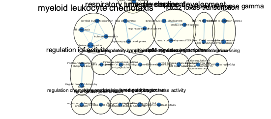

```{r setup, include=FALSE}
knitr::opts_chunk$set(echo = TRUE)
```

# Introduction

# Non-thresholded Gene set Enrichment Analysis

## 1.What method did you use? What genesets did you use? Make sure to specify versions and cite your methods.
I used GSEA [@gsea1, @gsea2] with the following parameters:
* Number of permutations: 1000
* Max size: 250
* Min size: 15
* Version: 4.1.0

Also, used the Human GO Biological Pathways geneset curated by Bader Lab on March 1, 2021, obtained [here](http://download.baderlab.org/EM_Genesets/March_01_2021/Human/symbol/) [@bader_genesets].

## 2.Summarize your enrichment results.
From enrichment result, it shows more downregulated gene set than upregulated, where upregulated have 2005 / 5459 gene sets and down regulated have 3454 / 5459 gene sets. As from the experiment,the enhancers are be mediated by inducing RNA enhancers. 

## 3.How do these results compare to the results from the thresholded analysis in Assignment #2. Compare qualitatively. Is this a straight forward comparison? Why or why not?

From both tools it shows the under regulation is more than upregulation. From the article, it says it can downregulated some, but not all, which is similar to the result from the tools. For aualitatively, GSEA was able to find more genesets, compare to G:Profiler, because GSEA uses non-thresholded instead of thresholded enrichment analysis. However the comparison is not straight-forward. Both tools are meant to provide an exploratory view of the data for further analysis, not to draw conclusions.

# Cytoscape Visualization

##1. Create an enrichment map - how many nodes and how many edges in the resulting map? What thresholds were used to create this map? Make sure to record all thresholds. Include a screenshot of your network prior to manual layout.

46 nodes and 47 edges. The following thresholds were used:
* FDR q-value cutoff: 0.1
* p-value cutoff: 1.0
* Metric: Jaccard+Overlap cutoff at 0.5 for sparser graph


##2. Annotate your network - what parameters did you use to annotate the network. If you are using the default parameters make sure to list them as well.


##3. Make a publication ready figure - include this figure with proper legends in your notebook.

##4. Collapse your network to a theme network. What are the major themes present in this analysis? Do they fit with the model? Are there any novel pathways or themes?

## Including Plots

You can also embed plots, for example:

```{r pressure, echo=FALSE}
plot(pressure)
```

Note that the `echo = FALSE` parameter was added to the code chunk to prevent printing of the R code that generated the plot.
